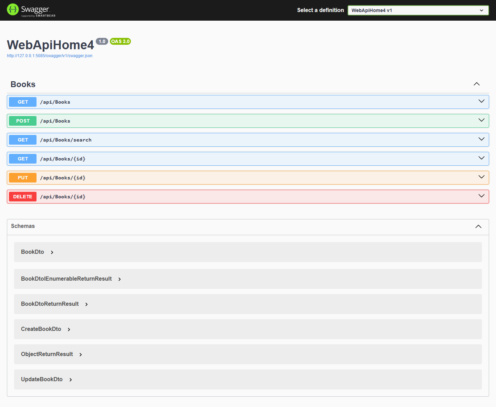
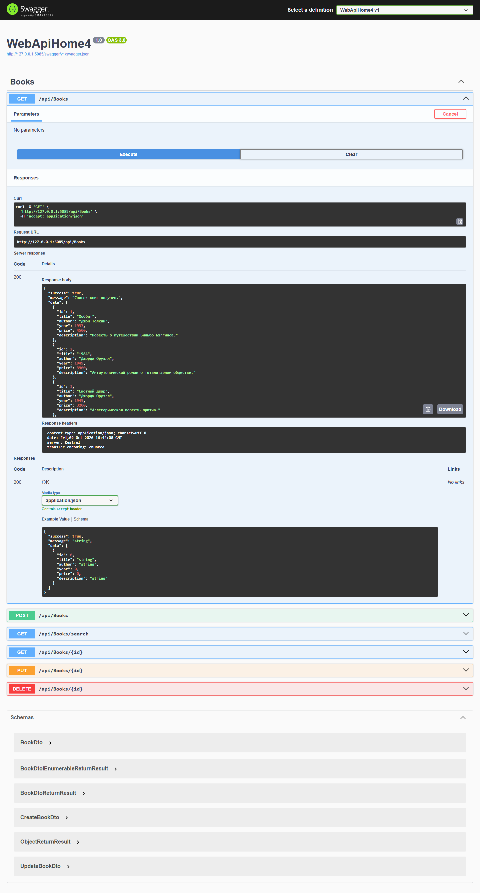
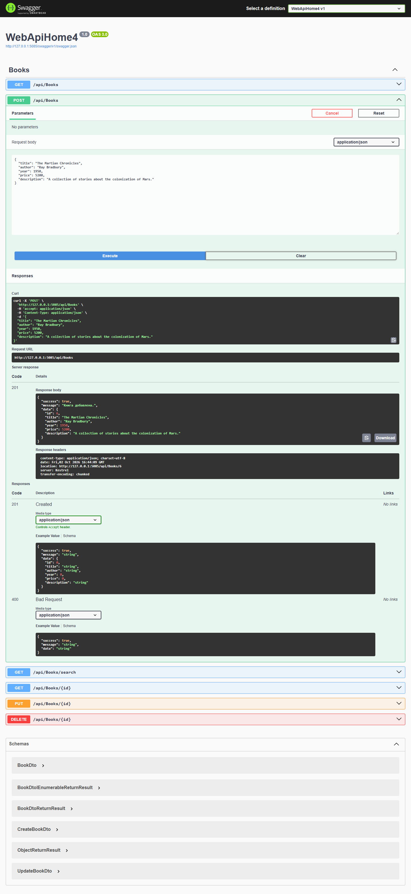
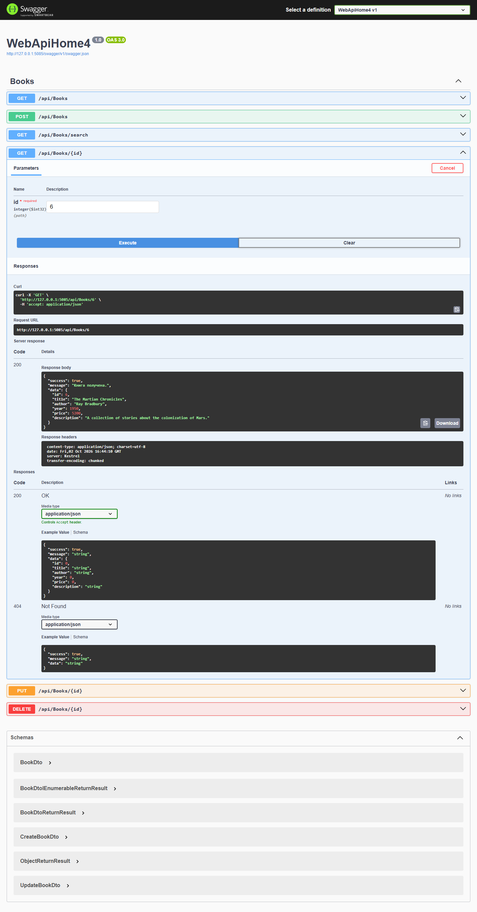
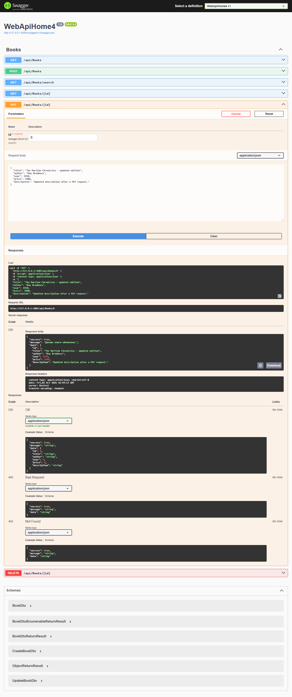
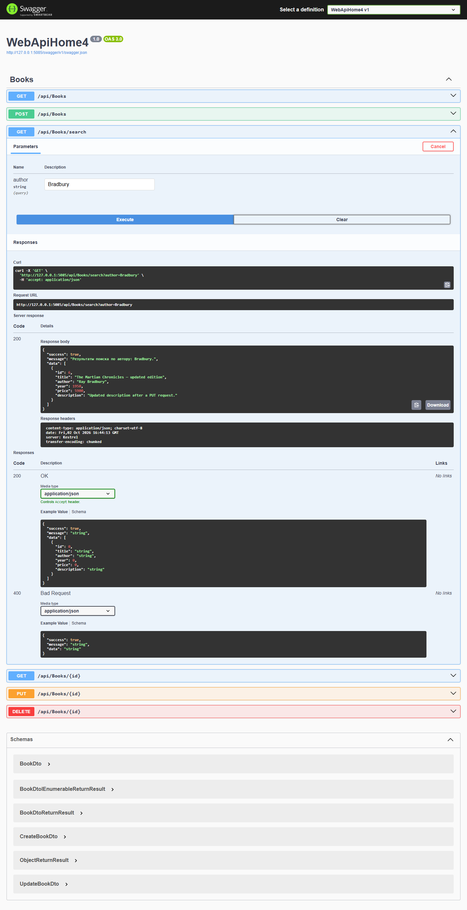
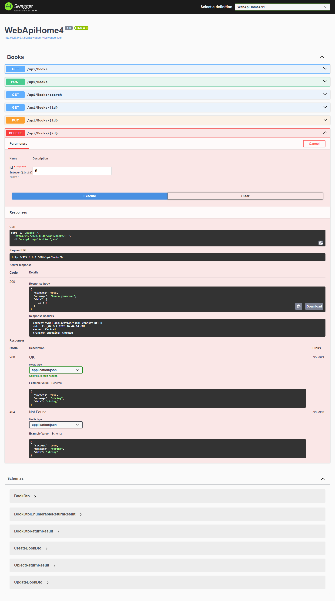
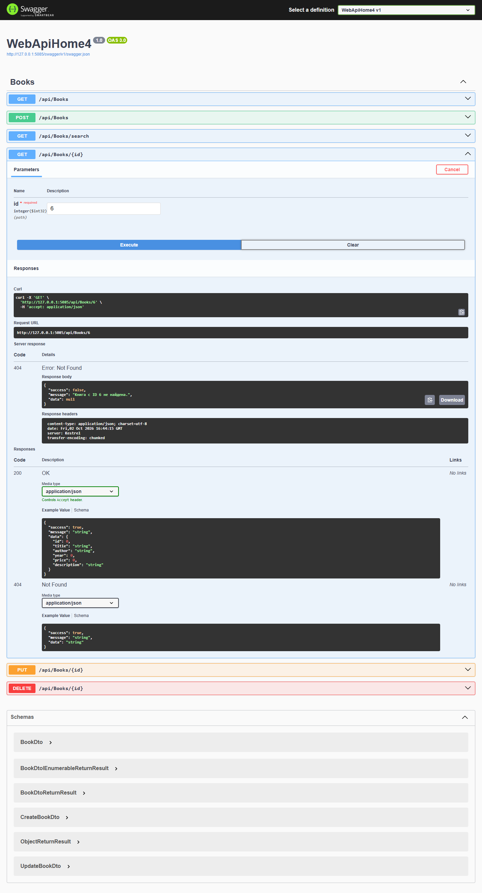
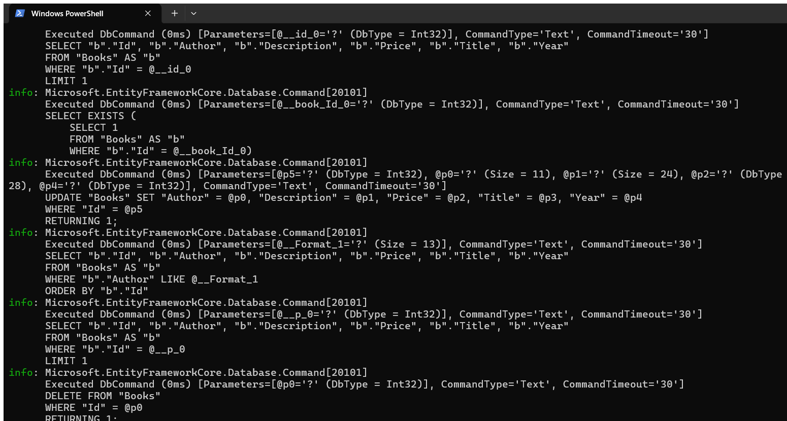

# Модуль 04. Каталог книг — DTO, AutoMapper, Repository и EF Core

**CSE5032 «Разработка веб-сервисов»**  
Самостоятельная работа студентов

## Краткий отчёт

Разработан ASP.NET Core Web API для каталога книг. API хранит книги в SQLite через Entity Framework Core, использует подход Code First и миграции, отдельные DTO, AutoMapper, Repository и общий формат ответа `ReturnResult<T>`. База при запуске приложения создаётся и обновляется применением миграций; начальные записи добавляются из миграции.

Для проверки Swagger UI: `http://127.0.0.1:5085/swagger`. Для повторного запуска из каталога проекта:

```powershell
dotnet run --urls http://127.0.0.1:5085
```

## Модель книги

| Поле | Тип | Ограничение |
| --- | --- | --- |
| `Id` | `int` | Первичный ключ, генерируется базой |
| `Title` | `string` | Обязательное, до 160 символов |
| `Author` | `string` | Обязательное, до 120 символов |
| `Year` | `int` | От 1450 до 2100 |
| `Price` | `decimal` | От 1 до 100 000 000, точность хранения 10,2 |
| `Description` | `string` | До 2000 символов |

`Book` — сущность базы данных. `BookDto` задаёт публичный формат чтения; `CreateBookDto` и `UpdateBookDto` валидируют входные данные. Автоматические преобразования между DTO и `Book` описаны в `BookMappingProfile`.

## Архитектура и шаги реализации

1. Создан проект ASP.NET Core Web API на шаблоне с контроллерами и Swagger.
2. Добавлены сущность `Book`, DTO для чтения/создания/изменения и правила проверки полей.
3. Создан `BookCatalogDbContext`; строка подключения SQLite хранится в `appsettings.json`.
4. Добавлена миграция Code First `InitialCreate` с таблицей и демонстрационными книгами. При запуске вызывается `Database.Migrate()`.
5. Доступ к данным вынесен в `IBookRepository` и `BookRepository`; контроллер не содержит EF-запросов.
6. AutoMapper преобразует входные DTO в сущность и сущность в DTO.
7. Все ответы контроллера имеют общую оболочку `ReturnResult<T>` с полями `success`, `message`, `data`; ошибки валидации, отсутствующей книги и необработанные ошибки возвращаются в таком же формате.
8. В `BooksController` реализованы CRUD и поиск по автору.

Назначение компонентов: **Entity** описывает сохраняемую запись; **DTO** отделяет контракт API от внутренней модели; **DbContext** связывает сущности с EF Core и базой; **Repository** изолирует операции чтения/записи; **AutoMapper** выполняет преобразование объектов по профилю; **ReturnResult** обеспечивает единый формат ответа.

## Endpoint и проверка в Swagger

| Метод | Endpoint | Назначение | Проверенный результат |
| --- | --- | --- | --- |
| `GET` | `/api/books` | Получить список книг | `200 OK` |
| `GET` | `/api/books/{id}` | Получить книгу по ID | `200 OK`, для отсутствующей — `404 Not Found` |
| `POST` | `/api/books` | Добавить книгу | `201 Created`; ошибочные данные — `400 Bad Request` |
| `PUT` | `/api/books/{id}` | Изменить книгу | `200 OK`, для отсутствующей — `404 Not Found` |
| `DELETE` | `/api/books/{id}` | Удалить книгу | `200 OK`, для отсутствующей — `404 Not Found` |
| `GET` | `/api/books/search?author=Bradbury` | Найти книги по автору (без учёта регистра) | `200 OK`; без автора — `400 Bad Request` |

Пример тела создания/изменения:

```json
{
  "title": "The Martian Chronicles",
  "author": "Ray Bradbury",
  "year": 1950,
  "price": 5200,
  "description": "A collection of stories about the colonization of Mars."
}
```

Пример успешного ответа (`ReturnResult<BookDto>`):

```json
{
  "success": true,
  "message": "Книга получена.",
  "data": {
    "id": 1,
    "title": "The Martian Chronicles",
    "author": "Ray Bradbury",
    "year": 1950,
    "price": 5200,
    "description": "A collection of stories about the colonization of Mars."
  }
}
```

## Скриншоты выполнения

Ниже размещены отдельные снимки реального Swagger UI после нажатия **Try it out** и **Execute**. В демонстрации выполнена последовательность: создание → получение → изменение → поиск по автору → удаление; затем проверен `404` для удалённой книги.

### Swagger и доступные операции



### GET — список книг



### POST — создание книги



### GET — книга по ID



### PUT — изменение книги



### Поиск книги по автору



### DELETE — удаление книги



### Проверка после удаления



### Вывод EF Core в PowerShell



## Вывод

В работе реализован API каталога книг с Code First на EF Core, SQLite, миграцией, Repository, DTO, AutoMapper, единым форматом ответа и полным CRUD. В Swagger проверены основные операции, поиск по автору и ответ `404` для отсутствующей книги.
